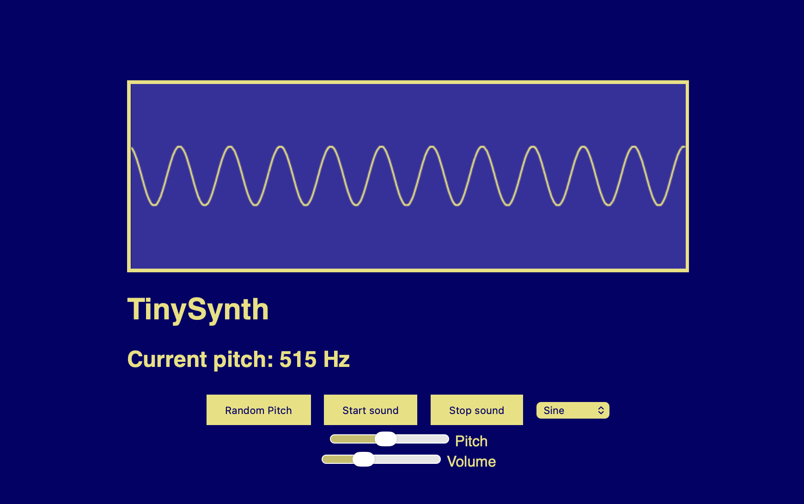

# TinySynth
This is a simple synth that people can use to make sounds. You can start and stop the sound, change the pitch, change the volume, and change the type of oscillator that is used.



## How to use it
Using this tool is pretty simple, you can paste the URI into your URL bar and it will load. The URI can be found at dist/uri.txt. To start the sound you can either press your spacebar or click the start sound button. The spacebar can also be used to stop the sound as well as a button that is on the screen which will allow you to turn it off. You can use the pitch slider to change the pitch of the sound and the volume to change the volume. Theres also a button you can use to randomise the pitch. Finally, the dropdown to the right allows you to change the type of oscillator that is used. This will change how it sounds and how it look in the waveform

## How it works
It uses a simple oscillator using javascript as well as the canvas tag to draw the waveform on the page. It works by having the start button start the oscillator which is plugged into a gain node. This then connects to the analyser which allows for a visual of the waveform. Finally it then connects to the speakers allow for the sound to be heard.

## Building
The source code can be found in /src/index.html. So you can build it to get the URI yourself run these commands:
```
npm install
node build.mjs
```